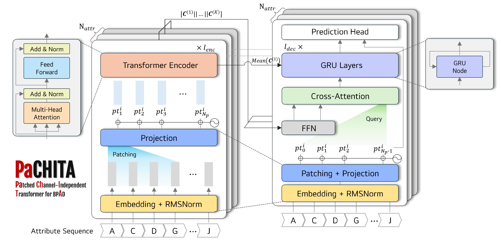

# PaCHITA: Patch-based Business Process Anomaly Detection



A multi-perspective anomaly detection method for business process event logs. PaCHITA segments traces into overlapping patches via a sliding window, encodes each attribute channel independently with Transformer encoders, fuses cross-channel information, and decodes with GRU-augmented decoders to reconstruct activity and attribute sequences. Anomaly scores are derived from reconstruction likelihood at trace, event, and attribute levels.

## Project Structure

```
PaCHITA/
├── main.py                  # Training & evaluation entry point
├── model/
│   ├── model.py             # PaCHITA wrapper (fit/detect)
│   └── compo.py             # Components (PatchEmbedding, ChannelEncoder, Decoders)
├── generator/               # Event log generation with anomaly injection
│   ├── gen_anomalous_real_life_log.py
│   └── generation/          # Anomaly types & attribute generators
├── processmining/           # Event log data structures (Log, Case, Event)
├── utils/
│   ├── dataset.py           # Dataset loading, caching, patch generation
│   ├── eval.py              # Precision, Recall, F1, AUPR evaluation
│   ├── fs.py                # File system paths and helpers
│   ├── anomaly.py           # Label-to-target conversion
│   └── enums.py             # Enumerations (AttributeType, Class, etc.)
├── scripts/
│   ├── generate_logs.sh     # Generate anomalous event logs
│   └── run.sh               # Run PaCHITA training & evaluation
├── eventlogs/               # Generated event logs (JSON format)
└── results/                 # Evaluation results (CSV)
```

## Usage

### Generate Event Logs

Place real-life event log files (`.xes` or `.xes.gz`) in `generator/real-life_Logs/`, then run:

```bash
bash scripts/generate_logs.sh
```

This injects anomalies (skip, rework, early, late, insert, attribute) into the logs at a configurable anomaly rate and saves them to `eventlogs/`.

### 2. Train & Evaluate PaCHITA

```bash
bash scripts/run.sh
```

Or directly with Python:

```bash
python main.py
```

## Evaluation

Anomaly detection is evaluated at three granularity levels:

- **Trace-level** — Is the entire trace anomalous?
- **Event-level** — Which events within a trace are anomalous?
- **Attribute-level** — Which specific attributes of which events are anomalous?

Metrics: Precision, Recall, F1-score (best threshold), and Average Precision (AUPR).

## Acknowledgments

The event log generation framework and baseline implementations are adapted from [BPAD](https://github.com/guanwei49/BPAD) (Guan et al., 2025).


